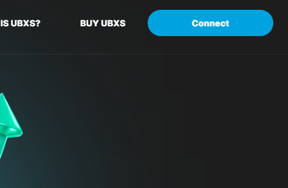
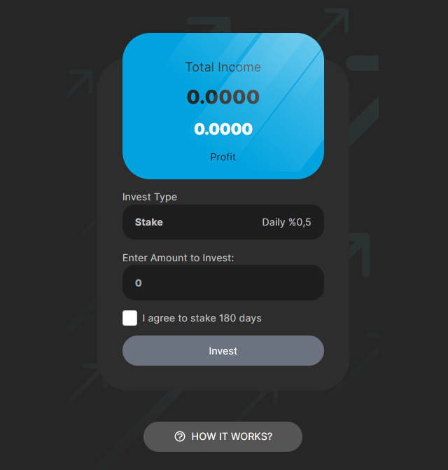
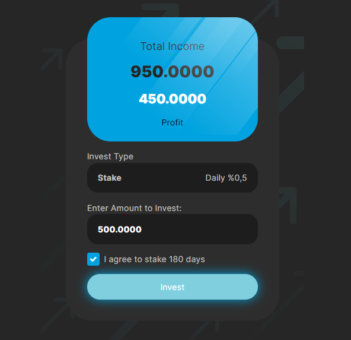
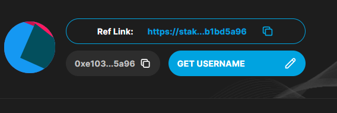

# How It Works?

Navigate to:&#x20;

**•** You must have installed [Metamask ](../../informative-articles/metamask/)correctly and imported the ubxs token to your address. \
Check Metamask

1\. Click to connect button and connect your wallet.

<figure><figcaption></figcaption></figure>

2\. Click the profile icon and then scroll down and enter an amount to invest. If you don't have UBXS in your balance, buy ubxs.

<figure><figcaption></figcaption></figure>

3\. You are ready for the Invest transaction. Make your stake by entering an amount higher than 500.

<figure><figcaption></figcaption></figure>

4\. Then click on your profile icon and set a username for yourself.

<figure><figcaption></figcaption></figure>

5\. Done! Now copy your referral address from the top and share it with other people.
