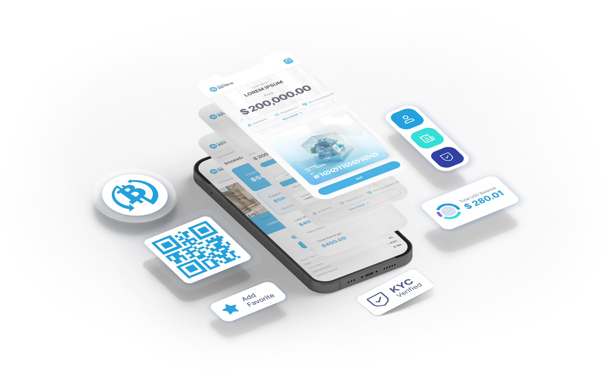

# 10. BIXOS SUPERAPP

The Bixos App is not simply a mobile application; it is a meticulously crafted digital ecosystem designed to provide Bixos community members with a comprehensive and intuitive gateway to the world of blockchain-powered real estate. Through the app, you'll gain unparalleled access to essential information, engaging content, and exclusive features that empower you to navigate and leverage the full potential of the Bixos token (UBXS).

Personalized and Dynamic Experience:

* Invest with Confidence: Monitor your UBXS token balances, transaction history, and market performance in real-time, empowering informed investment decisions.
* Stay Ahead of the Curve: Receive timely push notifications and access in-app news feeds, ensuring you're always abreast of crucial platform updates, market trends, and community initiatives.
* Shape the Future: Participate in voting mechanisms and surveys, directly influencing the platform's direction and contributing to its growth and evolution.

Engaging content and community building:

* Immerse Yourself: Explore the Bixos ecosystem through curated video presentations and high-quality photo galleries showcasing real estate properties and platform developments.
* Connect and Contribute: Join interactive forums and participate in discussions with fellow community members, fostering collaboration and knowledge sharing.
* Stay Informed and Inspired: Read insightful articles, discover thought leadership pieces, and gain valuable perspectives on the future of blockchain-powered real estate.

Unlocking the Power of UBXS:

* Maximize Your Investment: Utilize your UBXS tokens to gain preferential access to future token releases and discounted platform services, optimizing your investment potential.
* Play to Earn: Participate in strategically designed games and interactive experiences within the app, earning UBXS rewards and contributing to the platform's dynamism.
* Empowerment Through Governance: Leverage your UBXS holdings to actively participate in the Bixos DAO, shaping platform policies and future direction.

A Launchpad for the Future:

The Bixos App is meticulously crafted and currently undergoing rigorous development, scheduled for launch in 2024. It represents a cornerstone of the Bixos ecosystem, designed to empower users and seamlessly integrate them into the world of tokenized real estate ownership. Download the Bixos App and become a part of the revolution, shaping the future of real estate one token at a time.

\

<figure><figcaption></figcaption></figure>
